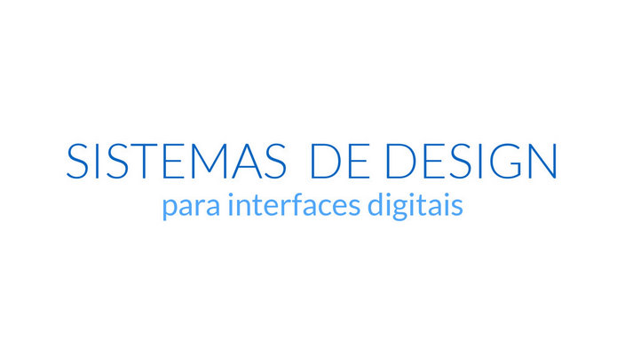

## 1º Meetup IxDA Floripa + ModularUI: práticas emergentes na criação de interfaces digitais
 

**Data:** 30 de setembro de 2015 
**Horário:** 19h 
**Valor:** Gratuito 
**Local:** Capitão Gourmet Bar e Restaurante 
Rua Lauro Linhares, 600 - Trindade, 88.036-001 Florianópolis, Brazil

###**//Chamada:** 
Encontro do ModularUI com grupo IxDA Florianópolis para discutir boas práticas no processos de desenvolvimento de interfaces digitais.

Serão 4 talks com temas complementares abordando temas relacionados à integrações design & front-end e a práticas diárias que deixam os processo de trabalho mais ágil.

###**//Formato:** 
Serão dois blocos compostos de duas talks + uma sessão de bate-papo cada, totalizando 4 talks e duas sessões de bate-papo.

## **//Talks**:

#### 1) O usuário merece mais: Geralzão sobre alguns assuntos que você e sua equipe deveriam estar discutindo
*por Christian Spilhere*

**Slides:** https://speakerdeck.com/cspilhere/o-usuario-merece-mais  
**Links:** https://github.com/cspilhere/useful-links

***
 

#### 2) O que é preciso para criar um ambiente de trabalho saudável e produtivo?
*por Ítalo de Oliveira Mendonça*

**Slides:** http://pt.slideshare.net/italomen/o-que-preciso-para-criar-um-ambiente-de-trabalho-saudvel-e-produtivo  

Sentar na frente da tela de um computador é apenas uma das muitas atividades que um profissional que trabalha em projetos digitais precisa realizar. Mas o que acontece nos bastidores de um trabalho em equipe? 

Para responder a esta pergunta, explorarei três temas essenciais para um bom andamento de uma equipe que se preocupa em combinar produtividade com um ambiente de trabalho agradável. 

1. **Filosofia de trabalho explícita**

	Um texto que escrevi sobre a importância de definir uma filosofia de trabalho:  
http://blog.taller.net.br/lean-redesign-ui-episodio-02-a-filosofia-para-uma-gestao-agil/

2. **Comunicação sem ruídos**

	Sobre pair entre designers:  
https://medium.com/sketch-app-sources/pair-designing-cocriar-para-ser-mais-produtivo-e-fugir-do-%C3%B3bvio-6f5bc863453a

	Sobre projetar em aberto:  
https://www.youtube.com/watch?v=7rW9vTrN6OU

3. **Papel do designer**  
	
	Para mediar processos criativos:  
http://goodkickoffmeetings.com/exercises

Grande abraço, Ítalo Mendonça  
www.italomen.com.br

***
 

   
#### 3) Sistema de design para interfaces digitais
*por Thiago Victorino*

**Slides:** https://speakerdeck.com/tfvictorino/sistemas-de-design-para-interfaces-digitais  

**Diretório de links sobre o mindset modular:** https://github.com/tfvictorino/modular-ui-directory

**Diretório de links sobre guias de estilos (artigos, materiais, exemplos):** http://styleguides.io/

**Exemplos apresentados:**

* **Codepen design patterns:** http://codepen.io/patterns/  
* **Bootstrap (UI Kit):** http://getbootstrap.com/components/  
* **Salesforce Lightning Design System:** https://www.lightningdesignsystem.com/  
* **U.S. Web Design Standards:** https://playbook.cio.gov/designstandards/

**Técnicas/Metodologias**

* **Atomic design:** http://bradfrost.com/blog/post/atomic-web-design/
* **Content priority guide:** http://seesparkbox.com/foundry/content_priority_guide
* **Style tiles:** http://styletil.es/
* **Ellement collages:** http://danielmall.com/articles/rif-element-collages/
  
***  
 

#### 4) Como o desenvolvimento iterativo e o Github vão fazer você e seu time mais felizes  
*por Id Ramos*

**Slides:** https://speakerdeck.com/idmarjr/como-o-desenvolvimento-iterativo-e-o-github-vao-fazer-voce-e-seu-time-mais-felizes  
**Links:** https://github.com/idmarjr/talk-ixda-meeting-september-2015
