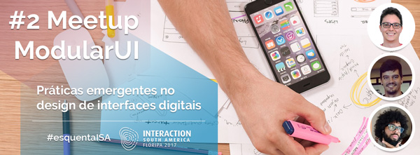

# 2º Meetup ModularUI: práticas emergentes no design de interfaces digitais

  

**Data:** 28 de março de 2017  
**Horário:** 19h  
**Valor:** Gratuito  
**Local:** Cheesecake Labs – Florianópolis/SC – Brasil

 

## Chamada
Na tentativa de abrir novos caminhos na construção de interfaces digitais, reunimos 3 designers para compartilhar seus experimentos mais recentes nessa edição do meetup da comunidade ModularUI. Uma mistura de disciplinas e técnicas que mostra o quanto temos a ganhar quando ousamos sair da nossa área de atuação em busca de novas visões e abordagens para os desafios que enfrentamos nos projetos atuais.

 

## Formato
3 talks de 15 minutos, com abertura para bate-papo entre uma apresentação e outra.

 

## Talks

### 1) Orientação a objetos aplicado ao design de interface
*por Thiago Victorino*

**Slides:** https://speakerdeck.com/tfvictorino/orientacao-a-objetos-aplicado-ao-design-de-interface  

**Palavras-chave:** Orientação a objetos, Arquitetura de Informação, Modelagem de dados    

**Resumo:** Nessa apresentação abordo o conceito de orientação a objetos e motivos pelos quais considero importante aplicar esse mindset durante o processo de modelagem de dados e arquitetura de informação no início de um projeto de interface, de forma colaborativa com o time de desenvolvimento. O conteúdo foi baseado no artigo _Object-oriented UX_ escrito por [Sophia Voychehovski](https://twitter.com/sophiavux).

**Referências citadas:**
- https://alistapart.com/article/object-oriented-ux
- https://alistapart.com/article/ooux-a-foundation-for-interaction-design

***

 

### 2) Atomic Design no contexto de times ágeis
*por Ítalo de Oliveira Mendonça*

**Slides:** https://pt.slideshare.net/italomen/atomic-design-no-contexto-de-times-geis  

**Palavras-chave:** Atomic Design, Agile, UI  

**Resumo:** A popularização dos conceitos do _Atomic Design_ (criado pelo [Brad Frost](https://twitter.com/brad_frost)) trouxe também muitas dúvidas e conflitos para os times de design de interface. Afinal, como implementar todos esses conceitos de componentização das interfaces num contexto de desenvolvimento ágil? A talk apresenta 3 dúvidas e algumas sugestões de como encará-los.

**Referências citadas:** http://atomicdesign.bradfrost.com/  

***

 

### 3) Assemblage: a natureza prática do design de produtos
*por Glauco Cardoso*

**Slides:** http://slides.com/gla/assemblage/

**Palavras-chave:** Complexidade, Design, Fluxo de trabalho  
